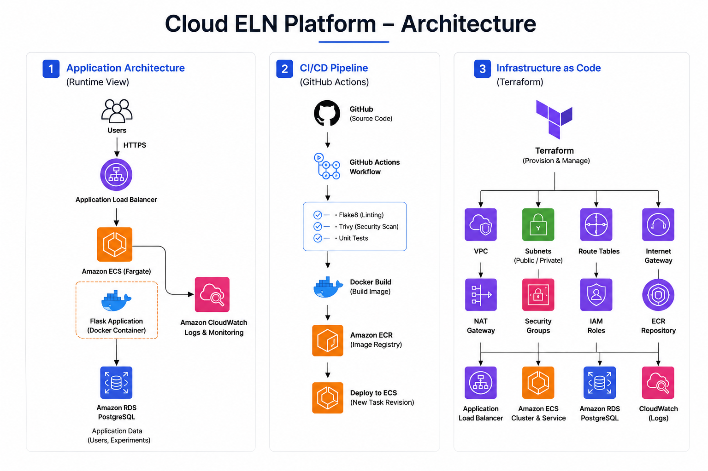
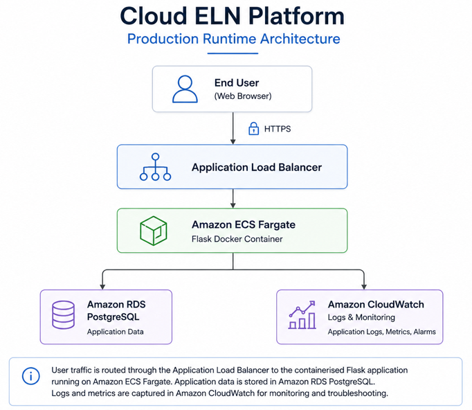
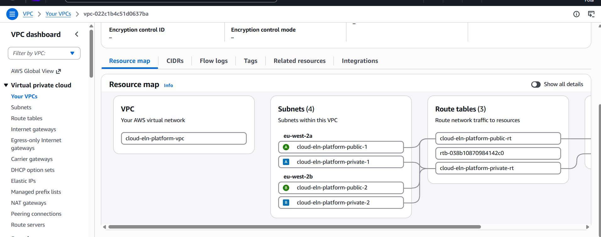
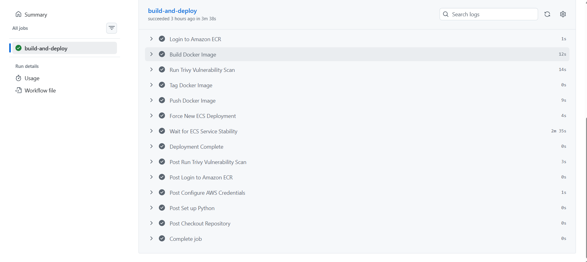
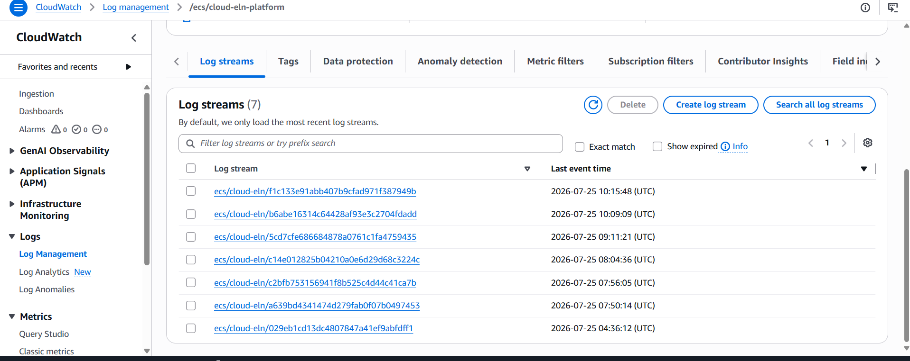
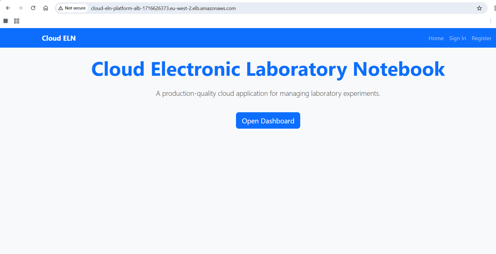
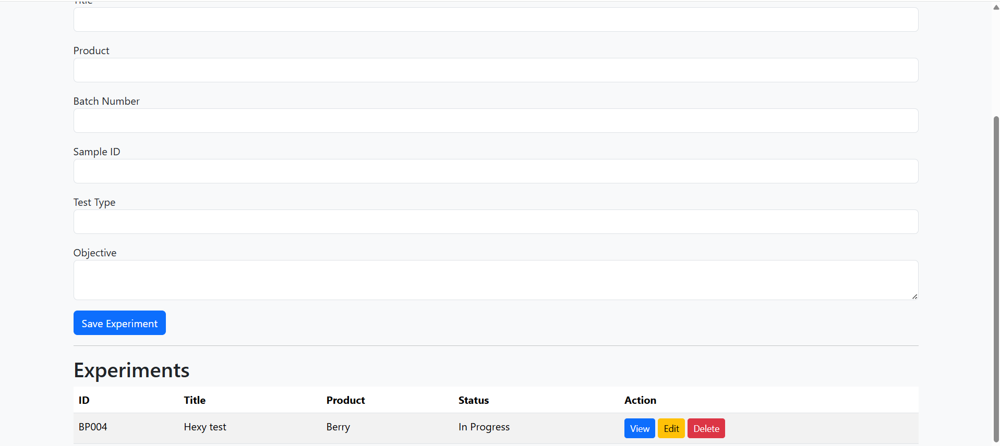
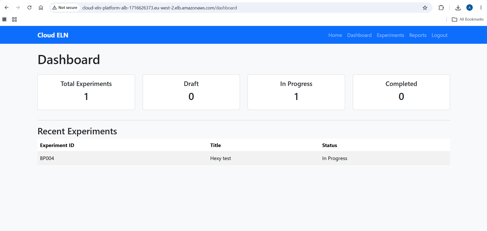

# Cloud ELN Platform

> Designing, deploying and automating a production-style Electronic Laboratory Notebook (ELN) platform on AWS using modern DevOps engineering practices.



---

# Project Overview

Cloud ELN Platform is a cloud-native Software-as-a-Service (SaaS) application designed to demonstrate how a modern laboratory management platform can be built and operated using AWS.

Rather than simply deploying a Flask application, the objective of this project was to build an end-to-end production-style environment that incorporates infrastructure automation, containerisation, continuous integration, continuous deployment, cloud networking, monitoring and secure database connectivity.

The project demonstrates how multiple AWS services work together to deliver a scalable, repeatable and maintainable application deployment.

---

# Why I Built This Project

Many laboratories continue to rely on spreadsheets, paper notebooks or disconnected desktop applications to record experimental data.

These approaches often make it difficult to:

- Track experiments
- Collaborate across teams
- Maintain data integrity
- Scale applications as data grows
- Deploy changes safely

I wanted to understand how these problems could be solved using cloud-native architecture rather than traditional application deployment.

Instead of focusing only on software development, this project focuses equally on infrastructure engineering and DevOps automation.

---

# Solution Architecture

The application is deployed entirely on AWS using a containerised architecture.

User requests are securely routed through an Application Load Balancer before reaching a Flask application running inside Amazon ECS Fargate.

Application data is stored within Amazon RDS PostgreSQL while logs are automatically streamed into Amazon CloudWatch for monitoring and troubleshooting.

Infrastructure is provisioned entirely using Terraform and deployments are automated through GitHub Actions.

---

## Runtime Architecture



---

# Key Features

### User Management

- User registration
- Secure authentication
- Password hashing
- Session management

### Experiment Management

- Create experiments
- Store experiment records
- View experiment history
- PostgreSQL persistence

### Cloud Infrastructure

- Containerised Flask application
- Amazon ECS Fargate deployment
- Amazon RDS PostgreSQL
- Application Load Balancer
- Private networking
- CloudWatch logging

### DevOps

- Infrastructure as Code using Terraform
- Docker containerisation
- GitHub Actions CI/CD
- Flake8 code quality checks
- Trivy container vulnerability scanning
- Automated ECS deployments

---

# Technology Stack

| Category | Technology |
|-----------|------------|
| Language | Python |
| Framework | Flask |
| Database | PostgreSQL |
| Containerisation | Docker |
| Container Registry | Amazon ECR |
| Container Orchestration | Amazon ECS Fargate |
| Infrastructure | Terraform |
| CI/CD | GitHub Actions |
| Monitoring | Amazon CloudWatch |
| Networking | Amazon VPC |
| Security | IAM, Security Groups |

---

# AWS Network Infrastructure

The application runs inside a custom Virtual Private Cloud consisting of multiple Availability Zones to improve resilience.

Infrastructure includes:

- Custom Amazon VPC
- Public and Private Subnets
- Internet Gateway
- NAT Gateway
- Route Tables
- Security Groups
- Application Load Balancer
- ECS Cluster
- ECS Service
- Amazon RDS PostgreSQL
- Amazon ECR
- CloudWatch

---

## AWS Infrastructure



---

# Continuous Integration & Deployment

Every change pushed to the main branch automatically triggers the deployment pipeline.

The pipeline performs multiple validation and deployment stages before updating the running application.

Pipeline stages include:

1. Repository checkout
2. Python dependency installation
3. Flake8 code quality checks
4. Trivy vulnerability scan
5. Docker image build
6. Push image to Amazon ECR
7. Force new ECS deployment
8. Wait for service stabilisation
9. Verify successful deployment

This ensures that every deployment follows a repeatable, automated process without requiring manual intervention.

---

## GitHub Actions Pipeline



---

# Deployment Workflow

Developer Push

↓

GitHub Actions

↓

Flake8 Validation

↓

Trivy Security Scan

↓

Docker Image Build

↓

Amazon ECR

↓

Amazon ECS Fargate

↓

Application Load Balancer

↓

Users

---

# Monitoring

Amazon CloudWatch continuously collects logs from the running containers.

These logs were essential throughout development for:

- investigating failed deployments
- diagnosing application errors
- identifying database issues
- verifying successful deployments
- monitoring container health

---

## CloudWatch Monitoring



---

# Application Screenshots

## Homepage



---

## Registered Experiment



---

## Logged In Dashboard



---

# Challenges Encountered

Building a cloud application involved considerably more than simply writing Flask code.

Several real-world deployment issues had to be investigated and resolved throughout development.

Examples included:

- Docker build failures
- ECS deployment failures
- Database migration issues
- Missing database tables
- User registration failures
- Trivy security scan failures
- Networking configuration issues
- GitHub Actions pipeline debugging

Each issue required investigation using CloudWatch logs, ECS service events, GitHub Actions workflow logs and PostgreSQL diagnostics before implementing a permanent solution.

A detailed breakdown can be found in:

- docs/troubleshooting.md

---

# Repository Structure

```
cloud-eln-platform/

├── app/
├── docs/
│   ├── architecture.md
│   ├── decisions.md
│   ├── deployment.md
│   ├── troubleshooting.md
│   └── screenshots/
├── migrations/
├── terraform/
├── .github/
├── Dockerfile
├── requirements.txt
├── run.py
└── README.md
```

---

# Lessons Learned

This project significantly improved my understanding of modern cloud engineering.

Key areas developed include:

- Infrastructure as Code
- AWS networking
- Docker containerisation
- ECS Fargate deployments
- CI/CD automation
- Infrastructure troubleshooting
- Cloud monitoring
- Secure application deployment
- Production deployment workflows

More importantly, it reinforced the importance of designing systems that are repeatable, automated and maintainable rather than relying on manual deployment processes.

---

# Future Improvements

Planned enhancements include:

- Amazon EKS (Kubernetes)
- Auto Scaling
- Blue/Green deployments
- AWS Secrets Manager
- Route 53 custom domain
- Amazon CloudFront
- AWS WAF
- Prometheus and Grafana
- Multi-tenant SaaS support
- Automated backups
- Disaster recovery strategy

---

# Documentation

Additional project documentation is available within the `docs` directory.

| Document | Description |
|----------|-------------|
| architecture.md | Detailed system architecture |
| deployment.md | Deployment process |
| decisions.md | Engineering decisions and trade-offs |
| troubleshooting.md | Common issues and resolutions |

---

# Author

**Afolabi Aramide**

Graduate DevOps / AWS Engineer

This project was built to demonstrate practical cloud engineering, DevOps automation and production-style AWS deployment using industry-standard tools and practices.
